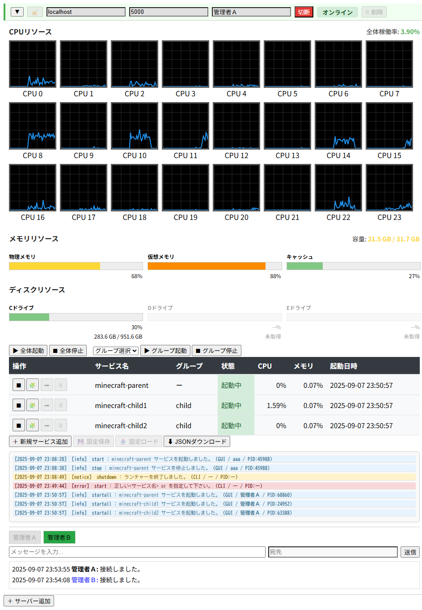
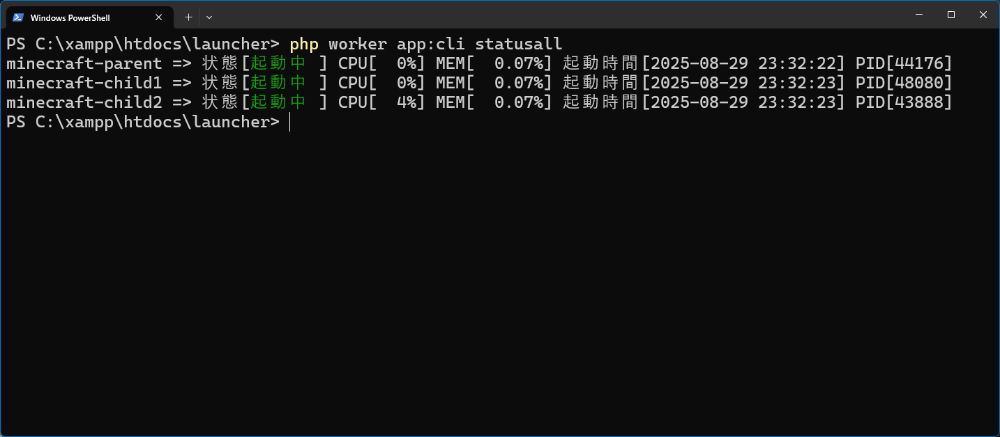

# SOCKET-MANAGER Launcher （GUI & CLI ランチャー）

SOCKET-MANAGER Framework をベースに構築された、クロスプラットフォーム対応のサービス管理ランチャーです。GUIモードとCLIモードの両方に対応し、柔軟な運用と高い可視性を提供します。

GUIモードではWebSocketサーバーを内蔵しており、ブラウザから直接接続可能。CLIモードでは軽量なランタイムライブラリを用いて、スクリプトや自動化にも適応します。

---

## 【 設計方針 】

- **GUIモードとCLIモードの両対応**  
  利用シーンに応じて切り替え可能。GUIはブラウザベース、CLIはコマンドライン操作に最適化。  

- **SOCKET-MANAGER Framework による実装**  
  以下ライブラリの融合的な実装。  
  CLIモード：常駐型アプリ開発用の RuntimeManager ライブラリ  
  GUIモード：ネットワークサーバー開発用の SocketManager ライブラリ

- **クロスプラットフォーム対応**  
  Windows / Linux で動作。GUI・CLIともに共通の設定ファイルで管理可能。  

---

## 【 GUI モード 】

### ＜ 画面 イメージ ＞



### ＜ 特 徴 ＞

- **WebSocketサーバー内蔵**  
  Webサーバーや中継サーバーが不要で、ブラウザから直接ランチャーに接続可能。  

- **スケールアウト対応**  
  複数の物理サーバーへ同時接続し、統合管理が可能。  

- **簡易サーバー監視機能**  
  CPU・メモリ・ディスクの使用率をグラフで可視化。  
  warn / alert / critical の3段階閾値で色分け・メール通知に対応。

- **サービス管理機能**  
  単体 / 全体 / グループ単位でのボタンによる起動・停止制御。  
  サービス単位で CPU / メモリ などのリソース使用率のリアルタイムな可視化。  
  サービス制御ログの一覧表示。  
  ブラウザ上でのサービス設定編集（追加・編集・削除）。  
  編集内容の保存・JSON形式でのダウンロード。  

- **設定ファイルのロード機能**  
  編集前の状態に戻したい場合や、バックアップファイルの適用が可能。  

- **論理CPUの割り当て**  
  論理CPU単位の稼働率グラフを見ながら負荷状況に応じた割り当てが可能。  

- **チャット機能**  
  管理者間のコミュニケーションに対応。通常メッセージとプライベートメッセージをサポート。

- **レスポンシブデザイン**  
  PC・タブレット・スマートフォンなど、画面サイズに応じて最適化。  
  モバイル端末からの接続ではWebサーバーが必要になります。（静的HTMLが解釈できないため）

---

## 【 CLI モード 】

### ＜ 画面 イメージ ＞



### ＜ 特 徴 ＞

- **サービス管理機能**  
  単体 / 全体 / グループ単位での起動・停止制御。  
  サービス単位で status アクションによる CPU / メモリ などのリソース使用率の可視化。  
  設定ファイルによるサービス設定編集（追加・編集・削除）。  

- **論理CPUの割り当て**  
  cpuinfo アクションで表示される論理CPU番号を使って設定ファイルにて割り当てが可能。  

- **自動再起動**  
  サービス停止を検知した際に自動起動。設定ファイルでON/OFF制御可能。

- **ログ保存**  
  アクション単位で追跡可能。daily / monthly の保存形式を選択可能。

---

## 【 基本アクションの種類 】

以下のアクションはサービス設定ファイル（JSON形式）と連携して動作します。  
GUIモード時は start/stop 系アクションのボタンを使って操作します。

- start  
  "サービス名"、あるいは"group:サービス名"を指定して起動

- startall  
  サービス設定ファイルで定義済みの全サービスを起動

- stop  
  "サービス名"、あるいは"group:サービス名"を指定して停止

- stopall  
  サービス設定ファイルで定義済みの全サービスを停止

- status  
  "サービス名"、あるいは"group:サービス名"を指定して状態表示

- statusall  
  サービス設定ファイルで定義済みの全サービスを状態表示

- cpuinfo  
  稼働中物理サーバーのCPU構成を表示（論理CPU割当用の参照情報）

※ group の設定はサービス設定ファイル内で行います。GUIモード時は画面で設定できます。

---

## 【 インストールと起動方法 】

以下の composer コマンドでインストールできます。

```
> composer create-project socket-manager/launcher <インストール先のディレクトリ名>
```

インストールが終わったらプロジェクトのルートディレクトリで `php worker app:cli` コマンドを入力し、以下のように Usage が表示されれば正常にインストールされています。

```php
> php worker app:cli

以下のいずれかを指定して下さい。
start <サービス名> or <group:グループ名>
startall
stop <サービス名> or <group:グループ名>
stopall
status <サービス名> or <group:グループ名>
statusall
cpuinfo
```

※初期状態のサービス設定ファイル `setting/service.json.sample` にはサンプルが定義されています。内容を定義後はファイル名をデフォルトの `service.json` にしてからお使い下さい。ファイル名は設定ファイルで変更可能です。

---

## 【 Contact Us 】
バグ報告やご要望などは<a href="mailto:lib.tech.engineer@gmail.com">`こちら`</a>から受け付けております。

---

## 【 License 】
MIT, see <a href="https://github.com/socket-manager/launcher/blob/main/LICENSE">LICENSE file</a>.